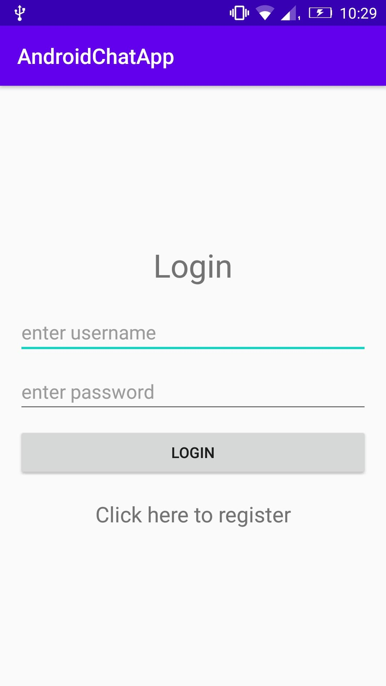
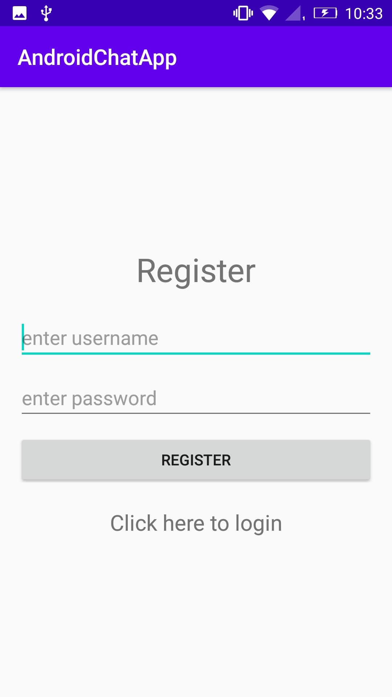
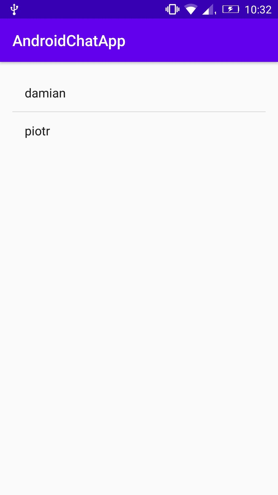
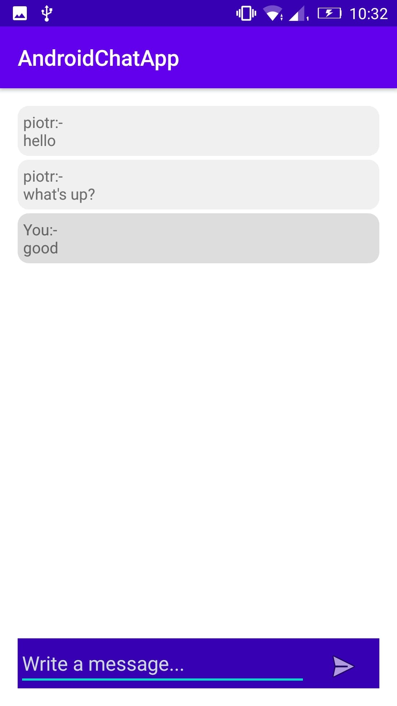

# ChatApp
Project for the laboratory "Cloud Computing w aplikacjach mobilnych dla platformy Android".
Author: Tomasz Zawadzki.
# General info
A very basic and simple chat app in which user can login and register in the system and can do one to one chat with other users.
# Technologies
This app was developed in Android Studio and Firebase.
# Setup
Download and replace links to my Firebase Database in files: Chat.java, Login.java, Register.java, Users.java with links to yours Firebase Database.
# Screenshots

